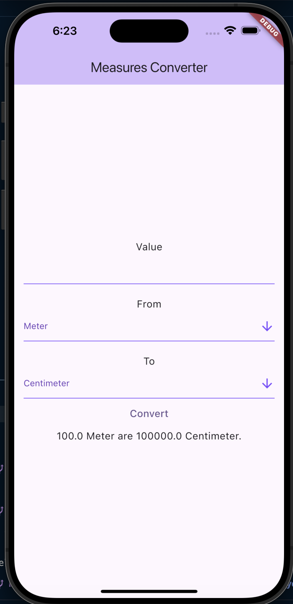

# MSCS533_Assignment1

## Setup
- **Step 1:** Download flutter https://docs.flutter.dev/get-started/install/macos/mobile-ios  by following this documents
- **Step 2:** Download XCode from Apple Store https://www.fluttermapp.com/blog/install-flutter-mac
- **Step 3:** Download Visual Studio Code https://code.visualstudio.com/
- **Step 4:** Create a metrics conversion project
```
flutter create metric_conversion
```
- **Step 5:** Checking if there are any missing dependencies
```
flutter doctor
```

## Output
To compile the applications inside the IOS Mobile, run the target OS version with the following command:
```
flutter run
```

We will have a simulated IOS Iphone 15 with the compilation code:
